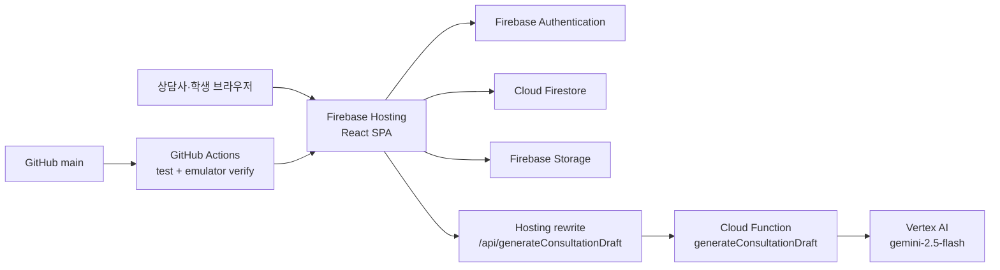

# 커리어핏(CareerFit) 프로젝트 인수인계

> 최종 갱신: 2026-07-23
>
> 기준 브랜치: `main`
>
> 기능 기준 커밋: `18ff7a3 feat: add evidence-based AI consultation drafts`

이 문서는 새로운 개발자 또는 다른 AI가 저장소만 보고 커리어핏의 목적, 구조,
디자인, 기능, Firebase 운영 방식과 남은 작업을 파악할 수 있도록 작성한 현재 상태의
정본(canonical handoff document)입니다.

실제 코드와 이 문서가 다르면 코드, Firebase 규칙, GitHub Actions 순으로 현재 동작을
확인한 뒤 이 문서를 함께 갱신해 주세요.

---

## 1. 프로젝트 한눈에 보기

| 항목 | 현재 값 |
| --- | --- |
| 서비스명 | 커리어핏(CareerFit) |
| 목적 | 대학 진로·취업 상담 업무와 학생의 상담 후 행동을 하나의 흐름으로 연결 |
| GitHub | <https://github.com/no-jisub/careerfit> |
| 기본 브랜치 | `main` |
| 운영 사이트 | <https://careerfit-aiboost-a601a.web.app/> |
| Firebase 프로젝트 ID | `careerfit-aiboost-a601a` |
| Google Cloud 프로젝트 번호 | `540520328208` |
| 공식 호스팅 | Firebase Hosting |
| 결제 요금제 | Blaze 활성화 |
| 프런트엔드 | React 19 + Vite 8 |
| 백엔드 | Firebase Auth, Firestore, Storage, Cloud Functions |
| 생성형 AI | Vertex AI `gemini-2.5-flash` |
| Cloud Function 리전 | `asia-northeast3` |
| CI/CD | GitHub Actions + Workload Identity Federation |
| 현재 운영 모드 | Firebase 실계정과 브라우저 데모 진입을 함께 제공하는 하이브리드 |

### 현재 가장 중요한 사실

- 운영 사이트에서는 이메일/비밀번호 로그인과 학생·상담사 회원가입이 활성화되어 있습니다.
- 로그인하지 않은 방문자는 상담사 또는 학생 데모로 진입할 수 있습니다.
- Firebase 익명 인증이 활성화된 배포에서는 데모 상담사도 제한형
  `generateDemoConsultationDraft` Function을 통해 실계정과 동일한 Vertex AI 모델을
  사용합니다. 익명 세션당 하루 15회, 전체 데모 하루 100회로 제한합니다.
- 실계정은 Firestore 데이터를 사용하고, 데모 계정은 브라우저 `localStorage`의
  가상 데이터만 사용합니다.
- AI 상담일지 초안은 브라우저가 아닌 Firebase Cloud Function에서 Vertex AI를
  호출합니다. AI API 키는 브라우저나 GitHub 저장소에 저장하지 않습니다.
- `main`에 push되면 GitHub Actions가 테스트 후 Firebase Hosting을 자동 배포합니다.
- GitHub Actions는 현재 **Hosting만** 자동 배포합니다. Functions, Firestore Rules,
  Storage Rules는 관련 코드 변경 시 수동 배포해야 합니다.
- 비교과 프로그램과 프로그램 추천 데이터는 아직 Firestore가 아니라 데모 데이터와
  `localStorage`를 사용합니다.
- 현재는 해커톤 검증 단계입니다. 실제 학생 개인정보를 운영에 넣기 전 개인정보 처리,
  감사 로그, 백업, App Check와 권한 최소화 작업이 더 필요합니다.

---

## 2. 프로젝트 목적과 제품 방향

커리어핏은 대학 상담 부서에서 다음 문제가 반복되는 것을 줄이기 위한 서비스입니다.

- 학생 정보, 이전 상담, 예약과 후속 조치가 여러 화면이나 문서에 흩어짐
- 상담 직전에 이전 맥락을 다시 찾는 시간이 오래 걸림
- 상담 후 학생과 상담사가 해야 할 일이 추적되지 않음
- 학생은 자신의 상담 내용 중 무엇이 공개되었는지 확인하기 어려움
- 비교과 프로그램 추천이 상담 기록과 분리됨
- 상담사가 작성한 메모를 정돈된 상담일지로 바꾸는 시간이 오래 걸림

핵심 제품 원칙은 다음과 같습니다.

1. 상담 전에는 이전 기록과 미완료 업무를 빠르게 파악합니다.
2. 상담 중에는 완성된 문장보다 핵심 메모를 남깁니다.
3. 상담 후에는 학생과 상담사의 다음 행동을 분리해 추적합니다.
4. 학생에게는 상담사가 공개 대상으로 선택한 내용만 보여 줍니다.
5. AI는 상담사를 대신해 판단하지 않고, 입력된 사실을 구조화하는 보조 도구로만 사용합니다.

---

## 3. 사용자 역할

### 상담 담당자: `counselor`

현재 소규모 운영 모델에서는 상담사가 상담 업무와 사용자 관리 기능을 함께 수행합니다.

- 전체 운영 대시보드
- 학생 검색·필터·상세 정보 수정
- 상담 예약·가능 시간 관리
- 상담 기록 작성·수정·공개 범위 선택
- Firestore 상담 기록 임시 저장
- Vertex AI 상담일지 초안 생성
- 후속 조치 등록·상태 관리
- 비교과 프로그램 관리·추천
- 학생·상담사 계정 등록
- 신규 상담사 승인·거절
- 회원가입 학생의 본인 담당 배정
- 학생 담당 상담사 재배정
- 탈퇴 예정 학생 계정 복구
- 알림과 운영 통계 확인

### 학생: `student`

- 이메일/비밀번호 회원가입과 이메일 인증
- 상담사 배정 대기 상태 확인
- 공개된 상담 가능 시간에서 상담 신청
- 상담 전에 주제, 전달 내용과 원하는 결과 입력
- 상담 자료 첨부
- 예약 상태·변경 이력·취소 주체 확인
- 예약 취소 또는 24시간 이전 시간 변경 요청
- 상담사가 제안한 변경 시간 참가/불참 선택
- 공개된 상담 요약과 상담 타임라인 확인
- 본인 후속 조치 완료 처리
- 추천 비교과 프로그램 확인과 반응 표시
- 연락처·관심 분야·진로 목표·현재 고민 수정
- 회원 탈퇴 요청

### 호환용 관리자: `admin`

- 기존 관리자 계정 호환을 위해 유지합니다.
- 대부분의 운영 화면에서 상담사와 같은 권한을 가집니다.
- 향후 실제 조직 운영 시 상담사와 관리자 권한을 다시 분리하는 것이 권장됩니다.
- 현재 `consultationDrafts` Firestore 규칙은 상담사만 허용하므로, 관리자 호환 계정의
  상담 임시 저장은 별도 점검이 필요합니다.

---

## 4. 전체 아키텍처



### 프런트엔드 상태 흐름

1. `src/main.jsx`가 `HashRouter`, `AuthProvider`, `ErrorBoundary`를 초기화합니다.
2. `src/auth/AuthContext.jsx`가 Firebase 로그인 또는 데모 역할을 결정합니다.
3. `src/App.jsx`가 역할별 라우트와 전역 데이터를 구성합니다.
4. 실계정이면 `src/services/firebaseDataService.js`가 Firestore 컬렉션을 실시간 구독합니다.
5. 데모 계정이면 `src/data/`의 가상 데이터와 `localStorage`를 사용합니다.
6. 화면의 저장 작업은 `persistDocument`, `persistDocumentGroup`을 통해 실계정에서는
   Firestore, 데모에서는 React 상태와 `localStorage`에 반영됩니다.

---

## 5. 기술 스택

| 영역 | 기술 | 현재 버전/설정 |
| --- | --- | --- |
| UI | React | `19.2.7` |
| 렌더링 | React DOM | `19.2.7` |
| 라우팅 | React Router DOM | `7.18.1`, `HashRouter` |
| 빌드 | Vite | `8.1.5`, `base: '/'` |
| Firebase Web SDK | Firebase | `12.16.0` |
| Firebase CLI | firebase-tools | `15.24.0` |
| 서버 SDK | firebase-admin | 루트 `^14.2.0`, Functions `14.2.0` |
| Functions SDK | firebase-functions | `7.3.0` |
| AI SDK | `@google/genai` | `2.13.0` |
| 런타임 | Node.js | `22` |
| Emulator용 Java | Temurin | CI에서 Java 21 |
| 테스트 | Node test runner | `node --test tests/*.test.js` |
| 배포 | Firebase Hosting | 정적 SPA |
| 서버리스 | Cloud Functions 2세대 | Node.js 22 |
| CI 인증 | Google WIF | 서비스 계정 JSON 키 없음 |

아직 ESLint, Prettier, React Testing Library, E2E 브라우저 테스트는 도입되지 않았습니다.

---

## 6. 저장소 구조

```text
.
├─ .github/
│  ├─ workflows/firebase-hosting-live.yml  # PR 검증, main Hosting 자동 배포
│  └─ dependabot.yml                       # npm/Actions 주간 업데이트
├─ design-system/careerfit/MASTER.md       # 디자인 시스템 정본
├─ docs/                                   # 기여 체크와 사용자 가이드 문서
├─ functions/
│  ├─ index.js                             # AI Callable Function
│  ├─ consultationDraft.js                 # 프롬프트, JSON 스키마, 응답 검증
│  └─ package.json
├─ scripts/
│  ├─ seed-emulator.mjs                    # Emulator 테스트 계정·데이터
│  ├─ verify-emulator-flow.mjs             # Auth/Rules/문서 흐름 통합 검증
│  └─ prepare-sites.mjs                    # 보조 Sites 호환 산출물
├─ src/
│  ├─ auth/AuthContext.jsx                 # 로그인·회원가입·계정 상태
│  ├─ components/                          # 공통 UI, 레이아웃, 반복 일정 폼
│  ├─ data/                                # 발표용 가상 데이터
│  ├─ lib/firebase.js                      # Firebase 초기화와 기능 플래그
│  ├─ pages/                               # 역할별 화면
│  ├─ services/                            # Firestore, Auth, Storage, AI 연결
│  ├─ styles/global.css                    # 전체 디자인·반응형 스타일
│  ├─ utils/                               # 예약·검증·알림·프로그램 로직
│  ├─ App.jsx                              # 전역 상태, 구독, 라우팅
│  └─ main.jsx                             # 앱 진입점
├─ tests/                                  # Node 단위 테스트
├─ firebase.json                           # Hosting/Auth/Rules/Emulator 설정
├─ firestore.rules                         # Firestore 보안 규칙
├─ firestore.indexes.json                  # Firestore 인덱스
├─ storage.rules                           # Storage 보안 규칙
├─ .firebaserc                             # 기본 Firebase 프로젝트
├─ .env.example                            # 환경변수 템플릿
├─ .env.emulator                           # Emulator 전용 공개 설정
├─ SECURITY.md                             # 보안 정책
└─ README.md                               # 이 인수인계 문서
```

### 보조 Sites 설정

- `.openai/hosting.json`, `sites` Git remote와 `scripts/prepare-sites.mjs`가 존재합니다.
- 공식 운영 배포 대상은 Firebase Hosting입니다.
- Firebase 배포 작업에서 Sites 프로젝트를 새로 만들거나 공식 URL로 간주하지 마세요.

---

## 7. 라우팅

이 앱은 `HashRouter`를 사용하므로 실제 URL에는 `#`이 포함됩니다.

### 공통·인증

| 경로 | 기능 |
| --- | --- |
| `/#/login` | 실계정 로그인, 비밀번호 재설정, 데모 진입 |
| `/#/signup` | 학생 또는 상담사 회원가입 |
| `/#/account-status` | 이메일 인증·상담사 승인·학생 배정 상태 |

### 상담 담당자·관리자

| 경로 | 기능 |
| --- | --- |
| `/#/dashboard` | 오늘 일정, 기록 필요, 후속 조치 요약 |
| `/#/students` | 학생 검색·필터·목록 |
| `/#/students/:studentId` | 학생 상세, 타임라인, 파일, 후속 조치 |
| `/#/students/:studentId/consultation/new` | 상담 기록 작성·AI 초안 |
| `/#/appointments` | 예약과 상담 가능 시간 관리 |
| `/#/consultations` | 전체 상담 기록 검색 |
| `/#/follow-ups` | 후속 조치 검색·필터·상태 관리 |
| `/#/notifications` | 계정별 알림 센터 |
| `/#/insights` | 기간별 운영 통계 |
| `/#/programs` | 프로그램 관리 또는 학생별 추천 |
| `/#/admin/users` | 계정 승인·학생 배정·재배정·복구 |
| `/#/settings` | 설정 |

### 학생

| 경로 | 기능 |
| --- | --- |
| `/#/student` | 학생 홈, 상담 요약·타임라인·후속 조치 |
| `/#/student/appointments` | 달력형 상담 시간 선택과 예약 내역 |
| `/#/student/appointments/request/:availabilityId` | 상담 신청 사전 내용 작성 |
| `/#/student/appointments/change/:appointmentId/:availabilityId` | 예약 변경 요청 |
| `/#/student/programs/:programId` | 추천 비교과 프로그램 상세·신청 정보 |
| `/#/student/notifications` | 학생 알림 |
| `/#/student/withdrawal` | 회원 탈퇴 요청 |

---

## 8. 구현된 기능 상세

### 8.1 로그인·회원가입·계정 상태

- Firebase 이메일/비밀번호 로그인
- 비밀번호 재설정 메일
- 학생 회원가입
- 상담사 회원가입
- 이메일 인증 메일 발송
- 이메일 인증 직후 ID 토큰 갱신과 `studentRegistrations.emailVerified` 동기화
- 승인 대기·거절·배정 대기·탈퇴 대기 화면
- 데모 상담사·학생 역할 진입

학생 회원가입 흐름:

1. Firebase Auth 계정 생성
2. `users/{uid}`를 `role=student`, `active=false`, `approvalStatus=pending`으로 생성
3. `studentRegistrations/{uid}` 생성
4. 이메일 인증
5. 상담사가 인증 완료 학생을 선택해 자신의 담당으로 배정
6. `students`, `users`, `studentRegistrations`를 batch로 승인
7. 학생이 상태를 새로고침하면 학생 포털 접근

상담사 회원가입 흐름:

1. Firebase Auth 계정과 `users/{uid}` 대기 프로필 생성
2. 기존 승인 상담사가 사용자 관리 화면에서 승인 또는 거절
3. 승인 시 `active=true`, `approvalStatus=approved`

최초 승인 상담사가 전혀 없는 새 프로젝트에서는 UI만으로 부트스트랩할 수 없습니다.
Firebase Admin SDK 또는 기존 운영 절차로 최초 계정의 이메일 인증과
`users/{uid}` 역할·활성 상태를 설정해야 합니다. 비밀번호나 서비스 계정 키를 문서 또는
Git에 기록하지 마세요.

### 8.2 사용자 관리와 담당 학생 배정

- 상담사가 학생·상담사 Auth 계정을 별도 Firebase App 인스턴스로 생성
- 신규 상담사 승인·거절
- 이메일 인증 완료 학생 다중 선택 후 “내 담당” 배정
- 학생별 주 담당 상담사 1명
- 다른 상담사로 재배정
- 재배정 시 진행 중 예약, 미완료 교직원 후속 조치, 가입 문서와 알림도 이동
- 기존 상담 이력은 같은 `studentId`를 유지하므로 새 담당자가 확인 가능
- 재배정 이력은 최근 20건까지 학생 문서에 보관
- 탈퇴 예정 학생 계정 수동 복구

현재 상담사와 관리자는 운영 편의를 위해 다른 상담사의 학생과 상담 기록도 읽을 수
있습니다. 실제 조직 운영 전 최소 권한 모델을 다시 설계해야 합니다.

### 8.3 상담 가능 시간과 예약

상담사:

- 날짜·시작·종료 시간을 직접 입력해 예약 생성
- 달력에서 여러 날짜 선택 후 1시간 단위 가능 시간 일괄 생성
- 운영 시간 중 점심시간 등 여러 제외 구간 설정
- 최대 12주 반복 요일·시간 등록
- 제외 날짜와 제외 시간 설정
- 기존 일정·중복 가능 시간 자동 제외
- 가능 시간을 날짜별 접기/펼치기
- 가능 시간 수동 마감·재오픈
- 취소된 시간을 재오픈할지 마감 유지할지 결정

학생:

- 담당 상담사가 공개한 미래의 `open` 시간만 선택
- 예약 불가 날짜와 시간은 흐리게 표시하고 선택 차단
- 상담 유형, 주제, 전달 내용, 원하는 결과 입력
- 신규 신청은 `pending`
- 상담사가 확정하면 `confirmed`

상태값:

- 예약: `pending`, `confirmed`, `scheduled`, `completed`, `cancelled`
- 가능 시간: `open`, `booked`, `closed`

취소 정책:

- 학생과 상담사 모두 취소 가능
- 취소 주체와 취소 시각을 예약 이력에 보관
- 취소된 예약 문서는 삭제하지 않음
- 학생 취소 후 상담사가 결정하기 전까지 해당 시간은 마감 유지
- 지난 시간과 상담사가 수동 마감한 시간은 재오픈하지 않음

변경 정책:

- 상담 24시간 전부터는 시간 변경 불가, 취소는 가능
- 완료 또는 지난 상담은 변경 불가
- 학생 변경 요청은 상담사 승인 대기
- 상담사 변경 제안은 학생이 참가, 기존 일정 유지, 기존 일정 취소 중 선택
- 변경 전 날짜·시간은 `rescheduleHistory`에 보관
- 기존 상담 주제와 전달 내용은 변경 요청에 이어짐

### 8.4 상담 기록

- 확정·예정·완료 예약에서 상담 기록 작성 화면 연결
- 한 예약당 최종 상담 기록 한 건
- 예약의 학생, 날짜, 시간, 유형과 사전 전달 내용 자동 반영
- 최종 기록은 상담 시작 이후 저장
- 입력 중 약 3초 후 `consultationDrafts`에 Firestore 임시 저장
- 상담사 본인의 임시 기록만 조회·수정
- 페이지 재진입 시 임시 기록 복구
- 임시 기록 수동 삭제
- 최종 저장 후 임시 기록 삭제
- 최종 저장 시 연결 예약 자동 완료 처리
- 완료된 상담 기록 수정 가능
- 마지막 수정일과 수정 상담사 표시
- 복잡한 버전 이력은 구현하지 않음

저장 문서 분리:

- `consultations`: 상담사 운영용 정리 기록
- `consultationNotes`: 상담사 내부 원문 메모
- `consultationSummaries`: 학생 공개 전용 문서

학생 공개 선택 항목:

- 상담 요약
- 학생의 강점
- 개선 또는 고민 사항
- 추천 프로그램
- 후속 조치
- 다음 상담 계획

상담사 내부 메모는 학생에게 항상 비공개입니다.

### 8.5 AI 상담일지 초안

실계정으로 로그인한 승인 상담사·관리자가 사용할 수 있습니다.

```text
상담 작성 화면
→ Firebase ID 토큰이 포함된 Callable 요청
→ Hosting /api/generateConsultationDraft rewrite
→ generateConsultationDraft Cloud Function
→ 승인된 상담사 확인 + 일일 사용량 확인
→ Vertex AI gemini-2.5-flash
→ JSON 스키마 검증
→ 상담사 검토·수정
→ 명시적 최종 저장
```

입력:

- 상담 유형과 목적
- 학생의 현재 고민
- 상담사 내부 메모
- 상담사가 입력한 강점과 안내 내용
- 선택한 추천 프로그램
- 학생·상담사의 다음 행동
- 다음 상담 확인 사항

출력:

- 상담 목적
- 상담 주요 내용
- 학생의 강점
- 학생의 고민과 목표
- 담당자의 안내 내용
- 학생의 다음 행동
- 담당자의 후속 조치
- 다음 상담 확인 사항
- 주요 항목별 작성 근거
- 추가 확인 필요 항목
- 공개 전 민감정보 확인 경고

안전장치:

- 승인된 `counselor` 또는 `admin`만 호출
- 사용자당 하루 50회
- 입력 길이 제한
- `temperature: 0.2`
- `thinkingBudget: 0`
- JSON 응답 스키마와 서버 재검증
- 자료에 없는 사실·의도·성격·진단·성과 추측 금지 프롬프트
- 민감 특성 추론 금지
- 오류 로그에 상담 원문을 기록하지 않음
- AI 결과 자동 확정·자동 저장 금지
- 상담사가 저장 전 모든 내용을 수정 가능

상담 최종 저장 시 AI의 근거·확인·경고 정보는 상담사 전용 `aiReview` 필드에
보관하며 학생 공개 요약에는 포함하지 않습니다.

AI 관련 파일:

- `functions/index.js`
- `functions/consultationDraft.js`
- `src/services/consultationAiService.js`
- `src/pages/ConsultationFormPage.jsx`
- `tests/consultationAi.test.js`

### 8.6 첨부파일

- 상담 신청 시 최대 5개
- 파일당 최대 5MB
- 허용 형식: PDF, DOC, DOCX, PNG, JPEG
- Storage 경로:
  `appointmentAttachments/{appointmentId}/{attachmentId}/{fileName}`
- 해당 예약의 학생과 상담사만 읽기·업로드 가능
- Storage Rules와 서비스 함수는 상담사 삭제, 학생의 상담 완료 전 삭제 정책을 지원
- 파일 메타데이터는 예약 문서의 `attachments` 배열에 저장

현재 Storage Emulator는 프런트엔드 초기화에 연결되어 있지 않습니다. Emulator 개발
환경에서 첨부파일 흐름을 시험하려면 `connectStorageEmulator`와 Storage Emulator 설정을
추가하거나 별도 테스트 프로젝트를 사용해야 합니다.

현재 화면에는 첨부파일 열기와 업로드가 연결되어 있지만 삭제 UI는 연결되어 있지
않습니다. 삭제 기능을 완성할 때 `deleteStoredAttachment`와 `canDeleteAttachment`를
예약 상세 화면에 연결해야 합니다.

### 8.7 후속 조치·알림·통계

후속 조치:

- 학생 담당과 교직원 담당 구분
- 예정·진행 중·완료·기한 초과 상태
- 학생은 자신의 항목만 완료 처리
- 상담 저장 시 학생·교직원 후속 조치를 함께 생성 가능
- 검색, 상태, 담당자 필터

앱 내부 알림:

- 신규 상담 신청
- 예약 확정·변경·취소
- 신규 학생 배정
- 오늘 상담
- 후속 조치 기한 임박·초과
- 새 공개 상담 요약
- 중복 방지를 위한 결정적 알림 ID
- Firestore 계정별 읽음 상태
- 클릭 시 관련 화면 이동

이메일·웹 푸시는 구현하지 않았습니다. 이메일은 Auth 인증과 비밀번호 재설정에만
사용합니다.

운영 통계:

- 최근 7일·30일·90일·전체 기간
- 상담 기록 수
- 상담 학생 수
- 상담 유형별 수
- 후속 조치 완료율·기한 초과율
- 예약 완료율·취소율

### 8.8 비교과 프로그램

- 2026년 7월 23일 기준 강남대학교 대학일자리플러스센터 공개 프로그램 중
  모집 예정·접수 중·운영 중이거나 운영 종료일이 지나지 않은 17건을 검토해 반영
- 데모 프로그램 등록·수정·복제·보관
- 모집 예정·모집 중·마감·운영 종료 상태 계산
- 대상 학년·학과 검증
- 운영 방식과 검색 필터
- 주요 프로그램 강조
- 학생 관심 분야·학년·태그 기반 규칙 추천
- 상담사가 학생에게 직접 추천하고 추천 사유 입력
- 학생이 관심 있음·신청 완료·참여하지 않음으로 반응
- 상담 기록에 선택 프로그램 추가
- 학생의 “신청정보 보기”에서 내부 상세 화면으로 이동
- 상세 화면에서 모집·운영 기간, 장소, 대상, 정원, 마일리지와 담당 연락처 확인
- 실제 신청과 최신 정보 확인은 강남대학교 원본 프로그램 페이지로 연결

중요 제한:

- 프로그램 목록과 학생별 프로그램 추천은 현재 Firestore 동기화 대상이 아닙니다.
- 실계정으로 로그인해도 프로그램 데이터는 `src/data/`와 `localStorage` 기반입니다.
- 학교 비교과 사이트와 실시간 크롤링·API 동기화하지 않고 검토된 공개 정보 스냅샷을 사용합니다.
- 원본 데이터에서 접수기간이 실시기간 뒤로 표시된 3건은 상세 화면에 확인 경고를 표시합니다.
- 신청은 CareerFit에서 접수하지 않으며 강남대학교 원본 사이트에서 진행합니다.

---

## 9. 데이터 저장 모드

### 실계정 모드

조건:

```text
Firebase 설정 존재
+ VITE_FIREBASE_AUTH_ENABLED=true
+ VITE_FIRESTORE_SYNC_ENABLED=true
```

Auth 사용자와 역할이 확인되면 Firestore 실시간 구독을 사용합니다.

### 데모 모드

- `VITE_DEMO_MODE_ENABLED=true`일 때 로그인 화면에서 진입
- Firebase Auth의 익명 로그인을 활성화하면 역할 선택 시 데모 전용 익명 세션 발급
- 익명 세션은 Firestore 업무 데이터 권한 없이 제한형 Vertex AI 호출 인증에만 사용
- 데모 AI도 서버에서 직접 식별정보를 마스킹하고 실계정과 동일한 모델·스키마 사용
- 데모 AI 호출 한도는 익명 세션당 하루 15회, 전체 하루 100회
- 익명 인증 또는 데모 AI Function이 없는 환경에서는 기존 로컬 초안으로 대체
- `src/data/`의 가상 데이터 사용
- 변경 내용은 현재 브라우저 `localStorage`에 저장
- 브라우저 또는 도메인이 다르면 공유되지 않음
- 저장소를 지우면 초기 데모 데이터로 복구
- 실제 개인정보를 데모 모드에 입력하지 말 것

주요 로컬 키:

- `careerfit_role`
- `careerfit_users`
- `careerfit_student_registrations`
- `careerfit_students`
- `careerfit_consultations`
- `careerfit_consultation_summaries`
- `careerfit_consultation_notes`
- `careerfit_consultation_drafts`
- `careerfit_followups`
- `careerfit_appointments`
- `careerfit_counselor_availability`
- `careerfit_notifications`
- `careerfit_program_store`
- `careerfit_program_recommendation_store`

---

## 10. Firestore 데이터 모델

| 컬렉션 | 목적 | 주요 필드 |
| --- | --- | --- |
| `users` | 역할·승인·활성·탈퇴 상태 | `role`, `active`, `approvalStatus` |
| `studentRegistrations` | 학생 회원가입·배정 대기 | `uid`, `emailVerified`, `status`, `counselorUid` |
| `students` | 학생 업무 프로필 | `uid`, `counselorUid`, `studentNo`, `goal`, `concern` |
| `consultations` | 상담사 운영용 정리 기록 | `studentId`, `studentUid`, `counselorUid`, `appointmentId`, `aiReview` |
| `consultationSummaries` | 학생 공개 전용 상담 요약 | `studentUid`, `published`, `visibleFields` |
| `consultationNotes` | 상담사 내부 원문 메모 | `studentId`, `counselorUid`, `note` |
| `consultationDrafts` | 상담사별 작성 중 임시 기록 | `counselorUid`, `appointmentId`, `form` |
| `followUps` | 학생·교직원 후속 조치 | `owner`, `assigneeUid`, `dueDate`, `status` |
| `appointments` | 예약·취소·변경·첨부 메타데이터 | `availabilityId`, `status`, `rescheduleRequest`, `attachments` |
| `counselorAvailability` | 상담사 공개 가능 시간 | `date`, `time`, `duration`, `status`, `bookedByUid` |
| `notifications` | 계정별 앱 내부 알림 | `recipientUid`, `eventKey`, `readAt`, `to` |
| `aiUsage` | 사용자별 일일 AI 사용량 | `uid`, `dateKey`, `count` |
| `programs` | 향후 Firestore 프로그램용 규칙만 존재 | 현재 클라이언트 구독 안 함 |
| `auditLogs` | 감사 로그 예약 컬렉션 | 클라이언트 쓰기 금지, 생성 로직 미구현 |

문서 ID는 클라이언트에서 생성하는 경우가 많습니다. 새 컬렉션이나 복합 쿼리를
추가하면 `firestore.rules`와 `firestore.indexes.json`을 함께 검토하세요.

---

## 11. Firebase 보안 모델

`firestore.rules`는 마지막 catch-all에서 기본 거부합니다.

### 공통 권한 전제

- Firebase 인증 필요
- `email_verified == true`
- `users/{uid}.active != false`
- 역할은 ID 토큰 custom claim 또는 `users/{uid}.role`

### 상담사·관리자

- `isStaff()`는 `admin` 또는 `counselor`
- 현재 통합 운영 모델로 전체 학생과 상담 운영 문서를 읽을 수 있음
- 사용자 관리·학생 배정·예약·상담·후속 조치 관리 가능

### 학생

- 본인 `students.uid` 문서만 읽기
- 연락처, 관심 분야, 목표, 고민만 수정
- 학번·학과·담당 상담사는 수정 불가
- 본인의 예약만 읽기·제한된 변경·취소 가능
- 담당 상담사의 열린 가능 시간만 예약 가능
- `consultations`와 `consultationNotes` 읽기 불가
- `consultationSummaries` 중 본인 UID와 `published=true`만 읽기
- 본인 담당 후속 조치만 읽고 완료 상태만 제한적으로 변경

### Storage

- 예약 참가 학생 또는 담당 상담사만 접근
- 5MB 이하의 허용된 MIME 형식만 업로드
- 전체 catch-all 거부

### Hosting 보안 헤더

`firebase.json`에 다음이 적용됩니다.

- Content Security Policy
- `Cross-Origin-Opener-Policy: same-origin`
- 카메라·마이크·위치·결제·USB 차단 Permissions Policy
- `Referrer-Policy: no-referrer`
- `X-Content-Type-Options: nosniff`
- `X-Frame-Options: DENY`
- `/assets/**` 1년 immutable 캐시
- `/`, `/index.html` no-cache

### 비밀 관리

- Firebase 웹 설정은 공개 클라이언트 설정이며 GitHub repository variables로 빌드에 주입합니다.
- 서비스 계정 키, API 비밀키, 비밀번호, 토큰을 `VITE_` 변수나 Git에 넣지 않습니다.
- GitHub Actions는 WIF OIDC를 사용하므로 서비스 계정 JSON 키가 필요 없습니다.
- AI는 Application Default Credentials와 Function 서비스 계정을 사용합니다.
- `.gitignore`는 키·인증서·서비스 계정 JSON과 GitHub 임시 자격 증명을 차단합니다.

보안 운영 기준은 `SECURITY.md`도 함께 읽어야 합니다.

---

## 12. Firebase 프로젝트와 배포

### 프로젝트 연결

`.firebaserc`:

```text
default = careerfit-aiboost-a601a
```

Firebase Console:

<https://console.firebase.google.com/project/careerfit-aiboost-a601a/overview>

Hosting:

- `dist/` 배포
- SPA의 모든 일반 경로는 `/index.html`로 rewrite
- `/api/generateConsultationDraft`는
  `asia-northeast3/generateConsultationDraft`로 rewrite

### GitHub Actions 자동 배포

파일: `.github/workflows/firebase-hosting-live.yml`

PR:

1. checkout
2. Node 22, Java 21
3. `npm ci`
4. `npm run build`
5. `npm test`
6. Auth·Firestore Emulator 시드 및 통합 검증
7. 배포하지 않음

`main` push 또는 수동 실행:

1. 위 검증 작업 전부 통과
2. GitHub repository variables로 Firebase 웹 설정 주입
3. `VITE_FIREBASE_AUTH_ENABLED=true`
4. `VITE_FIRESTORE_SYNC_ENABLED=true`
5. `VITE_DEMO_MODE_ENABLED=true`
6. Google Workload Identity Federation 인증
7. Firebase Hosting 배포

WIF 설정:

```text
Provider:
projects/540520328208/locations/global/workloadIdentityPools/github-actions/providers/careerfit-main

Service account:
github-actions-hosting@careerfit-aiboost-a601a.iam.gserviceaccount.com
```

### 자동 배포되지 않는 항목

다음은 변경 시 직접 배포해야 합니다.

```bash
# Cloud Functions
npm run firebase:deploy:functions

# Firestore Rules + Indexes
npm run firebase:deploy:rules

# Storage Rules
npx firebase-tools deploy --only storage --project careerfit-aiboost-a601a

# Function과 Hosting을 함께
npx firebase-tools deploy --only functions:generateConsultationDraft,hosting \
  --project careerfit-aiboost-a601a
```

Windows PowerShell에서는 `npm` 실행 정책 문제가 있으면 `npm.cmd`, `firebase.cmd`를
사용할 수 있습니다.

### Firebase 기능 사용 상태

- Authentication: 이메일/비밀번호 활성화
- Firestore: 실계정 데이터 실시간 동기화
- Storage: 상담 준비자료 저장
- Functions: AI 상담일지 초안
- Hosting: 운영 SPA
- Vertex AI API: 활성화 및 Function에서 사용
- Analytics: `measurementId` 설정은 있으나 SDK 초기화는 하지 않음
- App Check: 아직 미적용

---

## 13. 환경변수

`.env.local`은 Git에서 제외됩니다. `.env.example`을 복사해서 사용합니다.

```text
VITE_FIREBASE_API_KEY
VITE_FIREBASE_AUTH_DOMAIN
VITE_FIREBASE_PROJECT_ID
VITE_FIREBASE_STORAGE_BUCKET
VITE_FIREBASE_MESSAGING_SENDER_ID
VITE_FIREBASE_APP_ID
VITE_FIREBASE_MEASUREMENT_ID
VITE_USE_FIREBASE_EMULATORS
VITE_FIREBASE_AUTH_ENABLED
VITE_FIRESTORE_SYNC_ENABLED
VITE_DEMO_MODE_ENABLED
```

규칙:

- Firebase 필수 설정이 없으면 Firebase 앱을 초기화하지 않습니다.
- Auth가 꺼져 있으면 자동으로 데모 모드가 됩니다.
- Firestore 동기화는 Firebase 설정 + Auth + Sync 플래그가 모두 필요합니다.
- Emulator 연결은 개발 빌드에서만 활성화됩니다.
- 환경변수 변경 후 개발 서버를 다시 시작해야 합니다.
- 모든 `VITE_` 값은 브라우저 번들에서 볼 수 있으므로 비밀값을 넣지 않습니다.

---

## 14. 로컬 개발

### 요구 사항

- Node.js 22
- npm 10 이상
- Emulator 사용 시 Java 21 이상

### 설치

```bash
npm ci
cd functions
npm ci
cd ..
```

루트 설치만으로 프런트엔드와 Emulator 검증은 가능하지만 Function을 수정·배포하려면
`functions/` 의존성도 설치되어 있어야 합니다.

### 데모 개발

```bash
cp .env.example .env.local
npm run dev
```

PowerShell:

```powershell
Copy-Item .env.example .env.local
npm.cmd run dev
```

### Auth·Firestore Emulator 개발

세 터미널에서 실행합니다.

```bash
# 터미널 1
npm run firebase:emulators

# 터미널 2
npm run firebase:seed
npm run firebase:verify

# 터미널 3
npm run dev:firebase
```

Emulator UI:

<http://127.0.0.1:4000>

Emulator 전용 계정:

| 역할 | 이메일 | 비밀번호 |
| --- | --- | --- |
| 관리자 | `admin@careerfit.local` | `CareerFit123!` |
| 상담사 | `counselor@careerfit.local` | `CareerFit123!` |
| 학생 | `student@careerfit.local` | `CareerFit123!` |

이 계정은 로컬 Emulator에만 존재합니다. 운영 계정으로 사용하지 마세요.

---

## 15. 주요 명령어

| 명령어 | 설명 |
| --- | --- |
| `npm run dev` | Vite 개발 서버 |
| `npm run dev:firebase` | Emulator 환경변수로 Vite 실행 |
| `npm run build` | 프로덕션 빌드 및 보조 Sites 산출물 |
| `npm test` | Node 단위 테스트 |
| `npm run preview` | `dist` 미리보기 |
| `npm run firebase:emulators` | Auth·Firestore·Functions·Hosting Emulator |
| `npm run firebase:seed` | Emulator 계정과 가상 데이터 생성 |
| `npm run firebase:verify` | Auth·Rules·문서 저장 흐름 검증 |
| `npm run firebase:deploy:hosting` | 로컬 Hosting 수동 배포 |
| `npm run firebase:deploy:functions` | Functions 배포 |
| `npm run firebase:deploy:rules` | Firestore Rules·Indexes 배포 |
| `npm run firebase:deploy:backend-config` | Auth·Rules·Indexes·Functions 배포 |

현재 단위 테스트는 53개이며 예약, 반복 가능 시간, 첨부파일, AI 응답, 상담 공개,
권한 역할, 알림, 프로그램과 입력 검증을 다룹니다.

최소 검증:

```bash
npm test
npm run build
```

Firebase 변경 시 추가:

```bash
npx firebase-tools emulators:exec \
  --project careerfit-local \
  --only auth,firestore \
  "npm run firebase:seed && npm run firebase:verify"
```

---

## 16. 디자인 시스템

정본:

`design-system/careerfit/MASTER.md`

### 방향

- 신뢰감 있는 대학 상담 운영 도구
- Calm, Data-Dense Service Dashboard
- 오늘 할 일과 다음 행동이 먼저 보이는 구조
- 카드, 목록, 필터가 많은 업무형 화면
- 상담사 화면은 효율성과 밀도, 학생 화면은 친근함과 이해 가능성을 우선

### 주요 색상

| 용도 | 값 |
| --- | --- |
| 기관 네이비 | `#1E3A5F` |
| 주요 액션 블루 | `#2563EB` |
| 배경 | `#F4F7FB` |
| 본문 네이비 | `#10213D` |
| 성공 | `#137A53` |
| 위험 | `#C53E45` |
| AI 강조 | `#6D4ED0` |

### 타이포그래피

```css
Pretendard, 'Noto Sans KR', system-ui, -apple-system, sans-serif
```

### UI 원칙

- 한 화면에서 가장 중요한 CTA 하나를 우선
- 상태는 색만 사용하지 않고 아이콘·문자 함께 표시
- 클릭 가능한 요소는 최소 44px 터치 영역 권장
- 키보드 포커스 표시 유지
- 375px, 768px, 1024px, 1440px 반응형 확인
- SVG 아이콘은 `src/components/Icon.jsx`의 공통 시스템 사용
- 이모지를 기능 아이콘으로 사용하지 않음
- 표·검색·필터 사이의 구분선과 정렬을 유지
- AI 기능은 보라색 계열로 일반 업무 기능과 구분

전체 스타일은 `src/styles/global.css` 한 파일에 집중되어 있습니다. 새 화면을 추가할 때
기존 클래스와 반응형 구간을 먼저 확인하세요.

---

## 17. Git 작업 규칙

- 기본 브랜치: `main`
- 원격 이름: `github`
- 저장소 URL: <https://github.com/no-jisub/careerfit.git>
- Conventional Commit 형식 사용

예시:

```text
feat: add counselor calendar export
fix: prevent duplicate appointment creation
refactor: separate consultation visibility rules
docs: update Firebase deployment guide
test: cover student reschedule denial
chore: update Firebase dependencies
```

작업 시작:

```bash
git status -sb
git fetch github
git pull --ff-only github main
```

사용자의 미커밋 변경을 임의로 되돌리지 마세요. 여러 팀원이 `main`을 사용하므로
가능하면 기능 브랜치와 PR을 사용하고, PR 검증이 통과한 뒤 병합하세요.

### 주요 개발 이력

| 커밋 | 내용 |
| --- | --- |
| `f2d0537` | Firebase Emulator 실제 로그인 환경 |
| `cfefa2e` | 상담 데이터를 Firestore 문서 단위로 분리 |
| `62c1471` | Firebase 기능 검증 후 배포하는 GitHub Actions |
| `cf73f33` | 운영 로그인과 비밀번호 재설정 |
| `bc579d5` | 상담사용 비교과 프로그램 관리 |
| `d5eef6b` | 학생 회원가입과 승인 대기 |
| `e7d420f` | 상담사의 가입 학생 본인 배정 |
| `5e69d1c` | 운영 Auth와 Firestore 동기화 활성화 |
| `aaa8d8b` | 상담사 승인과 학생 재배정 |
| `c9b2312` | 상담 가능 시간 일괄 등록과 달력 예약 |
| `705c0c5` | 취소 예약 시간 재오픈 정책 |
| `7f3df70` | 예약 변경 승인 흐름 |
| `3604639` | 예약 연계 상담 기록과 계정별 알림 |
| `ef84235` | 반복 상담 가능 시간 |
| `0172cef` | 상담 준비자료 첨부 |
| `a04f55f` | 상담 피드백·목표·성과 기능 제거 |
| `bea409d` | 서버 측 Vertex AI 상담 초안 |
| `0c7cbc9` | Hosting 동일 출처 AI Function 경로 |
| `03c1ebb` | Gemini 구조화 응답 안정화 |
| `18ff7a3` | 근거·추가 확인·민감정보 경고가 있는 AI 초안 |

전체 변경은 `git log --oneline --all`에서 확인합니다. 과거 커밋에는 현재 제거된 기능도
있으므로 최신 `main`의 코드를 기준으로 판단하세요.

---

## 18. 의도적으로 제거했거나 아직 없는 기능

다음은 과거 구현 후 제품 범위에서 제거했거나 아직 연동하지 않은 항목입니다.

- 상담 만족도·피드백 기능: 제거됨
- 상담 목표·성과 추적 기능: 제거됨
- 학생의 상담 기록 삭제 요청과 상담사 승인·반려: 제거됨
- 실제 비교과 사이트 크롤링·API 연동: 없음
- 이메일·웹 푸시 알림: 없음
- 실제 30일 후 Auth·Firestore 자동 삭제: 없음
- 상담 기록 전체 버전 이력: 없음
- AI 자동 확정·자동 저장: 의도적으로 없음
- 학교 SSO·학사 시스템 연동: 없음
- 감사 로그 자동 생성: 없음
- 개인정보 수집·이용 동의 최종 법률 문구: 확정 전

이 기능들을 다시 추가할 때는 과거 커밋이 존재한다는 이유만으로 그대로 복구하지 말고
현재 사용자 정책과 보안 규칙을 다시 확인하세요.

---

## 19. 현재 알려진 한계와 위험

### 실제 서비스 전 필수 검토

1. 상담사와 관리자가 전체 학생을 읽는 현재 `isStaff()` 권한을 조직 구조에 맞게 축소
2. Firebase App Check 적용
3. 개인정보 수집·이용 동의, 보유 기간, 문의처와 파기 절차 확정
4. 탈퇴 30일 후 자동 삭제 또는 익명화 백엔드 구현
5. 서버 생성 감사 로그와 감사 화면
6. Firestore 백업·복구·장애 대응 절차
7. 운영 모니터링, 오류 추적, 예산 알림과 AI 비용 대시보드
8. 첫 상담사 부트스트랩과 계정 회수 절차 문서화

### 기술 부채

- GitHub Actions가 Functions와 Rules를 자동 배포하지 않음
- 프로그램과 추천 데이터가 Firestore에 연결되지 않음
- 사용자 관리 계정 생성이 서버 Admin API가 아니라 브라우저의 보조 Firebase App 사용
- Storage Emulator 미연결
- 첨부 업로드와 예약 문서 저장이 하나의 원자적 트랜잭션이 아님
- `aiReview` 중첩 구조에 대한 Firestore Rules 상세 검증 없음
- `auditLogs` 생성 백엔드 없음
- ESLint·포맷터·컴포넌트 테스트·E2E 테스트 없음
- 메인 번들 크기 경고가 있어 추가 코드 분할 필요
- Firebase CLI 배포 시 Functions SDK 업데이트 권고가 표시될 수 있음
- 운영과 분리된 Firebase 스테이징 프로젝트 없음

### 데모 사용 주의

- 데모 데이터는 가상이지만 입력한 값은 브라우저 `localStorage`에 남습니다.
- 특히 상담 임시 기록도 데모 모드에서는 로컬에 저장될 수 있으므로 실제 개인정보를
  데모 화면에 입력하면 안 됩니다.

---

## 20. 권장 개발 우선순위

### P0: 안정성과 배포

1. GitHub Actions에 Functions·Rules 변경 감지와 안전한 배포 단계 추가
2. Firestore Rules Emulator 테스트 범위 확대
3. ESLint, 포맷터, React 컴포넌트 테스트와 핵심 E2E 도입
4. 운영·스테이징 Firebase 프로젝트 분리 여부 결정

### P0: 실제 개인정보 운영 준비

1. 역할별 최소 권한 재설계
2. App Check
3. 감사 로그
4. 탈퇴 30일 후 자동 파기
5. 백업·복구와 접근 권한 회수 절차

### P1: 핵심 기능 완성도

1. 프로그램·추천 Firestore 전환
2. 계정 생성·승인 작업을 서버 Callable Function으로 이동
3. 첨부파일 업로드 실패 보상 처리와 Storage Emulator
4. 알림 중복·읽음·탐색 E2E 검증
5. 접근성·모바일 회귀 검증

### P1: AI 운영 품질

1. 프롬프트 버전과 실제 사용 모델 버전 저장
2. 상담사가 AI 초안을 얼마나 수정했는지 익명 품질 지표 설계
3. 환각·편향·민감정보 노출 평가 세트
4. AI 비용·오류율 모니터링
5. 모델 교체 시 회귀 테스트

### P2: 외부 시스템

1. 대학 SSO
2. 학사 정보 최소 동기화
3. 비교과 시스템 공식 API 또는 데이터 제공 협의
4. 학교 이메일·알림 시스템 연동

---

## 21. 자주 발생하는 문제

### 배포 후 이전 화면이 보임

- `/`와 `/index.html`은 no-cache지만 브라우저 상태가 남아 있을 수 있습니다.
- 강력 새로고침 후 새 `/assets/index-*.js` 해시가 로드되는지 확인합니다.
- GitHub Actions의 `Build and deploy live site` 성공 여부를 확인합니다.

### 빈 화면

- Vite `base`가 `/`인지 확인합니다.
- 브라우저 콘솔의 CSP·자산 404를 확인합니다.
- Firebase Hosting rewrite가 마지막에 `** → /index.html`인지 확인합니다.

### Firebase 로그인은 되지만 접근 대기

- 이메일 인증 여부
- `users/{uid}.role`
- `users/{uid}.active`
- `users/{uid}.approvalStatus`
- 학생이면 `studentRegistrations`와 `students.uid`
- 로그인 후 ID 토큰 갱신 여부

### AI 초안이 실패

- 승인된 상담사·관리자 계정인지 확인
- `generateConsultationDraft` Function 로그에서 `stage`, `reason` 확인
- Vertex AI API와 Function 서비스 계정의 `roles/aiplatform.user` 확인
- 일일 50회 제한 확인
- Hosting의 `/api/generateConsultationDraft` rewrite 확인
- `functions/consultationDraft.js`의 JSON 스키마와 파서가 함께 변경되었는지 확인
- 상담 내용이나 원문을 로그에 추가하지 말 것

### 학생 예약이 안 됨

- 학생에게 `students.counselorUid`가 있는지 확인
- 선택한 가능 시간이 같은 상담사인지 확인
- `status=open`, 미래 시간, 24시간 정책 확인
- 예약 생성과 가능 시간 `booked` 변경이 같은 batch인지 확인

### Firestore permission-denied

- 앱 코드만 완화하지 말고 먼저 Rules에서 요구하는 필수 필드와 역할을 확인합니다.
- Rules를 변경하면 Emulator 검증 후 별도 배포합니다.
- `firebaseDataService.js`의 쿼리 조건이 Rules의 허용 범위와 맞는지 확인합니다.

---

## 22. 다른 AI가 작업을 시작할 때

1. `README.md`와 `SECURITY.md`를 전부 읽습니다.
2. `git status -sb`로 사용자와 팀원의 미커밋 변경을 확인합니다.
3. `git log -10 --oneline`으로 최근 변경을 확인합니다.
4. 작업 대상 페이지뿐 아니라 연결된 `utils`, `services`, Firebase Rules와 테스트를 찾습니다.
5. 현재 작업이 데모 상태와 실계정 Firestore 상태 모두에서 동작해야 하는지 확인합니다.
6. 예약·상담·배정처럼 여러 문서를 바꾸는 기능은 가능한 한 batch로 저장합니다.
7. Firestore 쿼리를 바꾸면 Rules와 Indexes를 같이 검토합니다.
8. UI 변경은 디자인 시스템과 모바일 레이아웃을 같이 확인합니다.
9. 비밀값을 코드·문서·로그·커밋에 넣지 않습니다.
10. 완료 전 `npm test`와 `npm run build`를 실행합니다.
11. Functions/Rules/Storage 변경이면 Hosting 자동 배포만 믿지 말고 해당 리소스를 배포합니다.
12. 배포 후 운영 URL의 실제 렌더링과 브라우저 오류를 확인합니다.
13. 기능과 운영 방식이 달라졌다면 이 README를 같은 커밋에서 갱신합니다.

### 완료 보고에 포함할 내용

- 변경한 기능
- 변경 파일
- 테스트와 빌드 결과
- Git 커밋
- GitHub push/PR 여부
- Firebase에서 배포한 리소스
- 운영 사이트 검증 결과
- 남아 있는 제한 또는 수동 설정

---

## 23. 보안 연락과 운영 주의

보안 취약점, 개인정보 노출, 인증 우회, Firestore Rules 오류 또는 자격 증명 노출은
공개 GitHub Issue에 상세 재현 정보나 키를 올리지 말고 저장소 관리자에게 비공개로
전달해야 합니다.

실제 학생 데이터를 사용하기 전 반드시 `SECURITY.md`와 이 문서의
“현재 알려진 한계와 위험”을 검토하세요.
